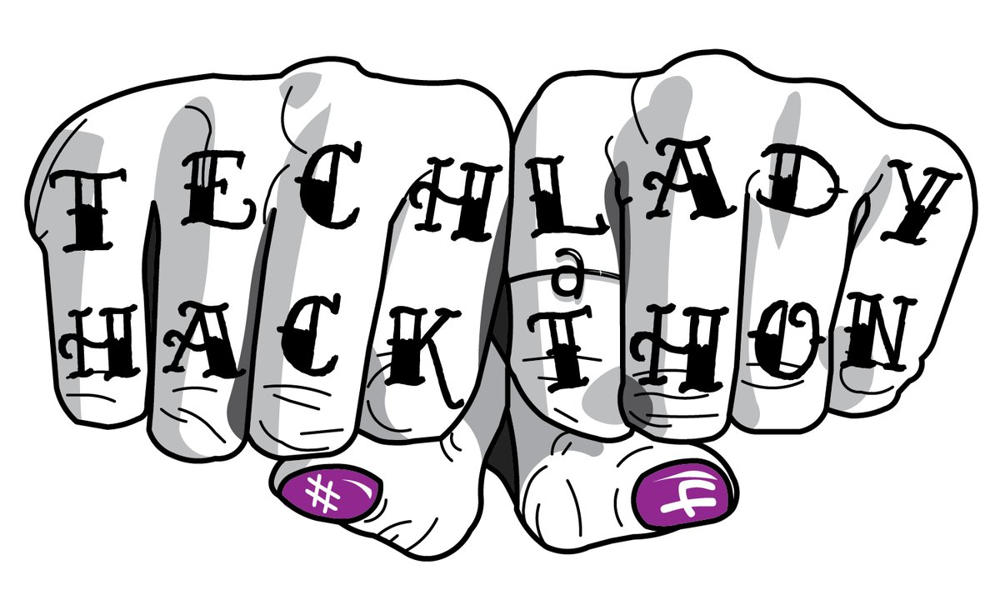

 

TechLady Hackathon 4 logo created by [@MarieCWhittaker](https://twitter.com/MarieCWhittaker)

#Data Collection: APIs and Web Scraping in Python 

**Workshop for Tech Lady Hackathon + Training Day DC #4, October 22, 2016**
 
[GitHub Repo](https://github.com/nd1/tlh4_workshop)

[Slides](https://nd1.github.io/tlh4_workshop/#/)

This workshop will introduce APIs and web scraping. There is a [Jupyter Notebook](https://github.com/nd1/tlh4_workshop/blob/master/workshop_notebook.ipynb) that walks through both in Python. I have also included [scripts](https://github.com/nd1/tlh4_workshop/blob/master/scripts) you can try out and modify for your own use!

The notebook and scripts are written for Python 3.

